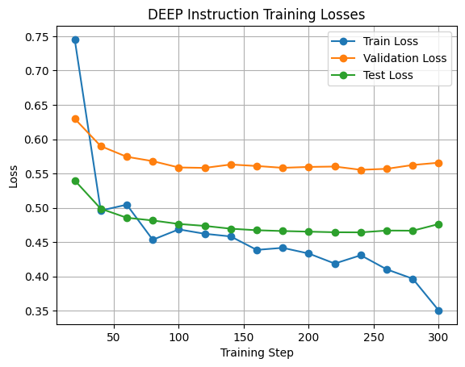
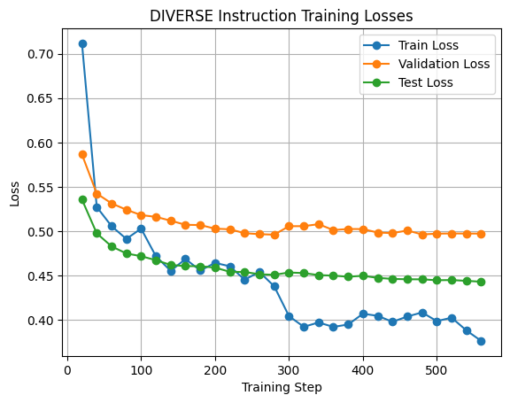
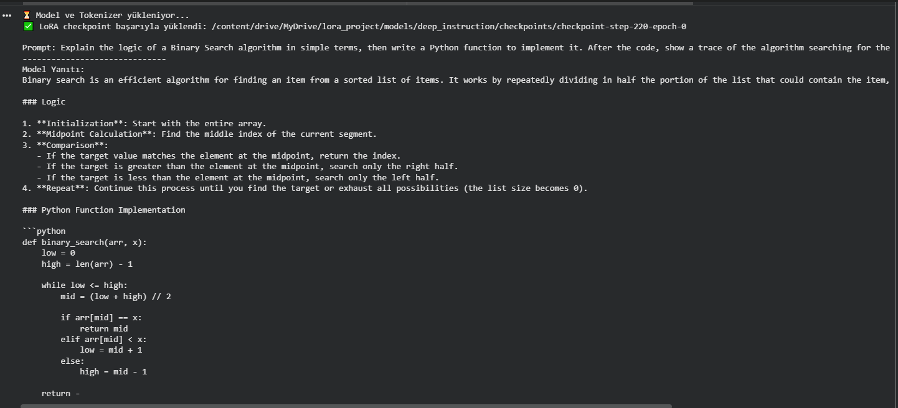
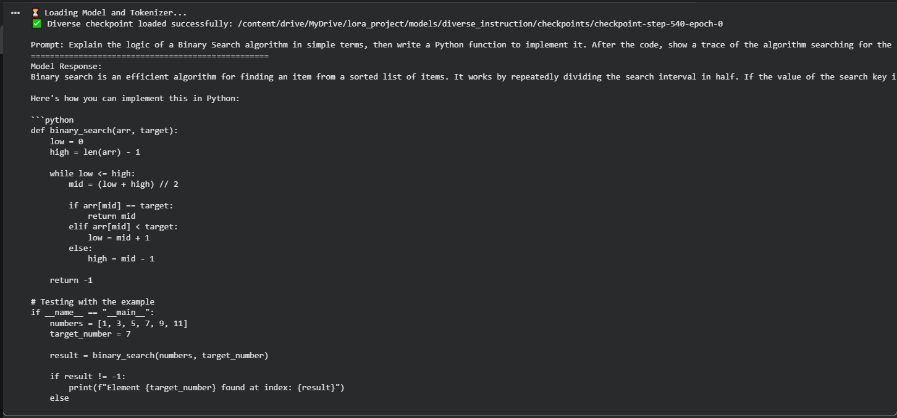

# LoRA Fine-Tuning Project: Deep vs. Diverse Instruction

[cite_start]This project focuses on fine-tuning the **Qwen2.5-Coder-1.5B-Instruct** base model using two different instruction strategies: **Deep** (logical reasoning focused) and **Diverse** (variety and paradigm focused)[cite: 6, 7, 8]. The goal is to compare their performance in solving Python programming challenges.

## 📊 Training Analysis

[cite_start]The models were trained for 3 epochs using a Rank of 16 and Alpha of 32[cite: 31, 32, 33]. [cite_start]Training logs were recorded every 20 steps to monitor for learning and potential overfitting[cite: 107].

### Loss Graphs
Below are the training, validation, and test loss curves for both experiments:

#### Deep Instruction Model

* **Interpretation**: The Deep model showed a consistent decrease in training loss, reaching its most generalized state at Step 220 before showing signs of validation loss fluctuation.

#### Diverse Instruction Model

* **Interpretation**: The Diverse model displayed a smoother descent in test loss through Step 560, suggesting that exposure to multiple solution paths per problem improved its generalization.

---

## 🏆 Benchmark Results

[cite_start]Models were evaluated using **41 AtCoder problems** (Easy difficulty) on the LiveCodeBench platform[cite: 43]. The results below show the Pass@1 scores for the best-performing checkpoints.

| Model | Best Checkpoint | Pass@1 | Solved Problems |
| :--- | :--- | :--- | :--- |
| **Deep Instruction** | **Step-220** | **33.3%** | **14/41** |
| **Diverse Instruction** | **Step-540** | **29.3%** | **12/41** |

---

## 💻 Visual Comparisons

### Logical Reasoning (Deep vs. Diverse)
When asked to explain Binary Search before coding, the **Deep** model provided a structured logical derivation, while the **Diverse** model focused on a clean, direct implementation.


*Deep Model: Step-by-step logic*


*Diverse Model: Direct implementation*

### Library Usage (Distance Calculation)
In multi-approach prompts, the **Diverse** model successfully utilized advanced library functions like `np.linalg.norm`, whereas the **Deep** model favored foundational mathematical methods like the dot product.


*Diverse Model: NumPy linalg usage*

---

## 📁 Repository Contents
* [cite_start]`train.py`: The LoRA fine-tuning script[cite: 100].
* [cite_start]`eval.py`: Inference and testing script for model evaluation[cite: 101].
* [cite_start]`requirements.txt`: Necessary Python libraries (Transformers, PEFT, etc.)[cite: 102].
* [cite_start]`*.json`: Training and validation logs containing loss values[cite: 103].

## ⚙️ Requirements
To run the project, install the dependencies:
```bash
pip install -r requirements.txt
