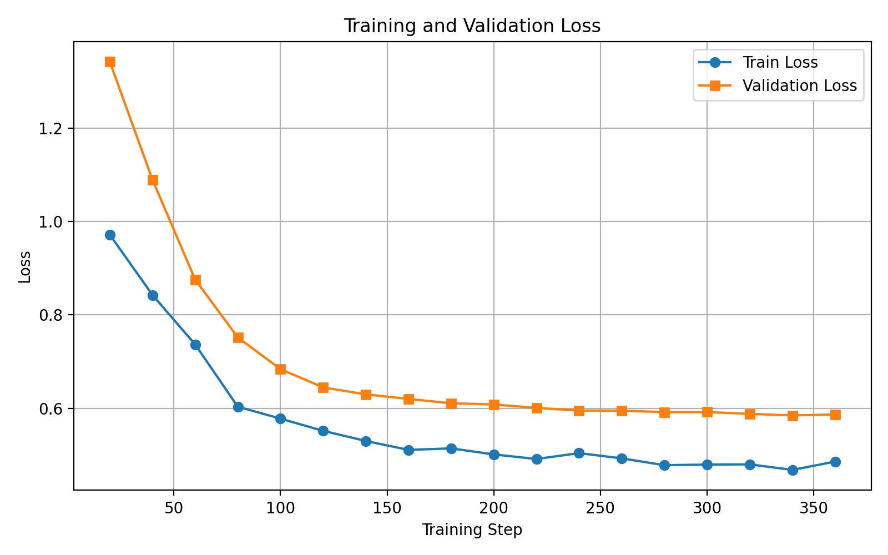

# LoRA Fine-Tuning Project  
**Qwen2.5-Coder-1.5B-Instruct**

## Overview

This project focuses on parameter-efficient fine-tuning of a large language model using **LoRA (Low-Rank Adaptation)**.  
The base model **Qwen2.5-Coder-1.5B-Instruct** is fine-tuned on two datasets to improve Python code generation quality while keeping GPU memory usage low.

The project strictly follows the given project specification and includes:
- Training with LoRA
- Loss logging (Train / Validation / Test)
- Required plots (every 20 steps)
- Benchmark evaluation
- Best checkpoint selection

---

## Model

- **Base Model:** Qwen/Qwen2.5-Coder-1.5B-Instruct  
- **Architecture:** Causal Language Model  
- **Precision:** FP16  
- **Fine-Tuning Method:** LoRA  

### LoRA Configuration

| Parameter | Value |
|--------|------|
| Rank (r) | 16 |
| Alpha | 32 |
| Dropout | 0.05 |
| Target Modules | q_proj, k_proj, v_proj, o_proj, gate_proj, up_proj, down_proj |

---

## Datasets

### CodeGen-Deep-5K (DEEP)
- Algorithmically complex problems
- Focus on deep reasoning and correctness

### CodeGen-Diverse-5K (DIVERSE)
- Broad range of problem types
- Encourages generalization

## Loss Graphs (Required)

### Deep Dataset Loss Graph
*Train / Validation / Test loss every 20 steps*

---

### Diverse Dataset Loss Graph
*Train / Validation / Test loss every 20 steps*

---

## Loss Analysis

### Deep Dataset
- Training and validation losses decrease steadily
- Test loss follows validation loss closely
- No strong overfitting observed

### Diverse Dataset
- Faster convergence due to data diversity
- Stable validation behavior
- Better generalization across unseen problems

Overall, both models demonstrate successful learning without memorization.

---

## Benchmark Evaluation

---

